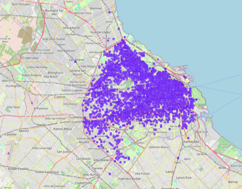

# Enunciado de Proyecto Final: Estimación de Precios de Alquiler en el AMBA

## Conjunto de Datos

El dataset `alquiler_AMBA_dev.csv` contiene los precios de alquiler de departamentos en el Área Metropolitana de Buenos Aires (AMBA), publicados en Mercado Libre Argentina durante 2021 y 2022, junto con varias características de cada publicación. Los precios de los alquileres fueron ajustados por inflación, lo que significa que se presentan en valores constantes a lo largo del tiempo.

Para construir la base de datos, se generaron polígonos de 200m x 200m, y cada publicación fue vinculada a uno de estos polígonos. Así, en lugar de utilizar coordenadas exactas, las publicaciones fueron asociadas al centroide de su polígono correspondiente para garantizar la anonimización de los datos. La Figura 1 muestra la distribución espacial de los polígonos creados. Para una visualización más detallada, consultar el archivo `mapa_amba.html`.



## Tarea básica

Desarrollar un modelo predictivo que permita estimar el precio de cualquier departamento que se encuentra en el AMBA dadas las mismas características que se presentan en el conjunto de datos `alquiler_AMBA_dev.csv`. Deberán presentar el proceso de desarrollo del “modelo final”, los resultados obtenidos y un análisis sobre la capacidad predictiva del mismo. El “modelo final” será evaluado por los docentes contra un conjunto de test usando la métrica RMSE.

## Ideas para extensiones

- **Visualización geoespacial de precios:** ¿Cómo se distribuyen los precios de alquiler en el AMBA cuando se visualizan en un mapa? ¿Emerge algún patrón cuando observamos la distribución espacial de los precios? En caso positivo, ¿se relacionan con alguna característica específica de los barrios o zonas?
- **Modelos predictivos por zona:** ¿Qué sucede si entrenan modelos predictivos específicos para diferentes barrios del AMBA en lugar de un único modelo para toda la región? ¿Existen diferencias notables en los errores de predicción entre las zonas? ¿Qué información adicional podrían obtener al comparar modelos locales con un modelo global?
- **Predicción de precios futuros:** ¿Cómo podrían evolucionar los precios de alquiler en el futuro, por ejemplo, para el año 2023? ¿Cómo se podrían visualizar las proyecciones en un mapa interactivo, y qué zonas muestran mayores cambios en los precios futuros?
- **Clustering de barrios:** ¿Qué patrones de precios emergen cuando aplican técnicas de clustering a los datos de alquiler? ¿Cómo se agrupan los barrios según las tendencias de precios? ¿Pueden identificar características en común entre los barrios de cada cluster?
- **Elasticidad del precio respecto a las amenities:** ¿Qué impacto tienen las diferentes amenities en el precio del alquiler? ¿Qué amenities parecen tener mayor influencia en los precios y en qué zonas es más significativo este efecto? Crear un dashboard interactivo donde se pueden seleccionar distintas combinaciones de amenities y ver cómo cambia el precio estimado en diferentes barrios o polígonos.
- **Integración de datos externos:** ¿Cómo se puede enriquecer el modelo predictivo integrando datos externos, como información socioeconómica o de infraestructura (cercanía a medios de transporte, centros comerciales, etc.)? ¿Qué efectos tienen variables externas, como ingresos promedio o proximidad a transporte público, en la predicción del precio del alquiler?
- **Simulación de políticas de alquiler:** ¿Qué impacto tendría una política que limite el aumento de los precios de alquiler en el AMBA? ¿Cómo variarán los precios proyectados bajo esta política en comparación con un escenario sin regulación? ¿Qué zonas experimentarían cambios más significativos y cómo se reflejarán estos cambios en la visualización de los datos?

## Entrega de Predicciones

Tal como se indica la Guía de Proyecto Final, deberán entregar un archivo `.zip` con uno o más archivos denominados:

`Apellido1_Apellido2_ModelX_predictions.csv`, donde `ModelX` representa el nombre del modelo.

Cada archivo `.csv` debe contener una fila de encabezado que incluya dos columnas: “id” y “predicted_price”. Por ejemplo:

```csv
id,predicted_price
1,100000
2,120000
```
